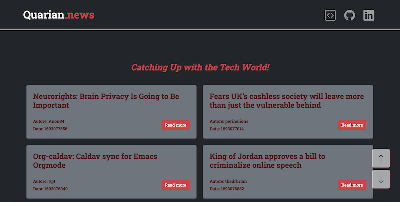

# Quarian.news

Sito web ottiene notizie sul mondo della tecnologia dall'API [Hackernews](https://github.com/HackerNews/API), che permette di ottenere notizie sul mondo della tecnologia.

Live demo hosted on Netlify: https://quarian-news.netlify.app/

## Tecnologie utilizzate
<ul style="list-style-type: none; padding-left: 0;">
    <li>HTML5 </li>
    <li>CSS3 </li>
    <li>Bootstrap 5 </li>
    <li>JavaScript </li>
    <li>Webpack </li>
</ul>

## Features
- **Chiamate API**: all'avvio viene effettuata una chiamata API per ottenere un elenco di 500 notizie;
- **Chiamate API simultanere**: Una volta ottenuto l'elenco delle notizie, vengono effettuate simultaneamente dieci chiamate per caricare le prime dieci;
- **Pulsante Load More**: permette di caricare ulteriori 10 notizie alla volta;
- **Alert di errore**: Sono previsti degli alert in caso di errori o esaurimento delle notizie disponibili;
- **Pulsanti autoscroll**: per poter tornare su e giù rapidamente;

## Screenshots
### Desktop

### Tablet

### Mobile

## Contatti
Linkedin https://www.linkedin.com/in/flaviopinto-dev/
Email: flaviopinto351@gmail.com